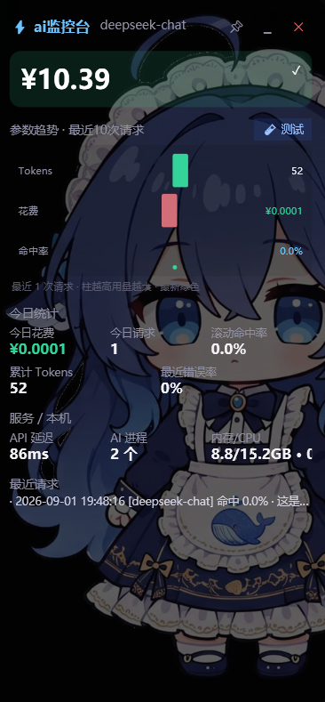

# ⚡ ai监控台

**你的 AI 用量小管家** —— 悬浮在桌面上的 DeepSeek API 参数监视器。

实时显示剩余余额、每次请求的缓存命中 / Token 用量 / 花费估算，并记录趋势图表。纯 Windows 原生实现（PowerShell + WPF），**零依赖、零安装**，解压即用。

## 📸 截图

## ✨ 功能特性

- 💳 **实时余额监控**：总余额、余额不足预警（<¥10 黄色、<¥5 红色）
- 📊 **参数趋势图表**：最近 10 次请求的 Tokens / 花费柱状图、缓存命中率折线图
- 🗃️ **缓存命中统计**：命中率、滚动平均命中率（最近 20 次）
- 💰 **花费估算**：按官方价格表计算每次与今日累计花费
- 🔌 **多客户端自动监控**：自动识别并读取 **DeepSeek Harness / Claude Code / Codex / Cherry Studio / aider / OpenCode / Cline / Roo Code** 的会话记录（真实 tokens 与缓存命中，8 秒增量刷新）
- 🖥️ **本机监控**：AI 进程数、内存、CPU（1.5 秒高频刷新）
- 🪟 **悬浮窗交互**：拖动、双击/按钮收起为照片小卡片、右键菜单、开机自启
- 🧭 **首次启动向导**：图形化引导配置 API Key，小白 3 分钟上手
- 🔐 **Key 安全**：Windows DPAPI 加密存储，不落明文、不上传

## 🖥️ 系统要求

- Windows 10 / 11（推荐 11）
- PowerShell 5.1 系统自带，无需额外安装
- 监控 Claude Code / Codex 需 Node.js ≥ 22（可选，不装则仅余额监控可用）

## 🚀 安装使用

1. 解压发布包（或克隆本仓库后直接使用）
2. 双击 `启动ai监控台.vbs`
3. 首次启动跟随向导：打开 DeepSeek 开放平台 → 创建 API Key → 粘贴并连接测试
4. 完成！悬浮窗开始监控

> 需要自备 [DeepSeek API Key](https://platform.deepseek.com)（AI 的"钥匙"）。

## 🔧 配置

| 方式 | 说明 |
|------|------|
| 向导界面 | 首次启动图形化配置（推荐） |
| 环境变量 | `DEEPSEEK_API_KEY` / `DEEPSEEK_BASE_URL`（可选，指向代理） |

数据目录：`%APPDATA%\ai监控台\`（Key 加密存储、用量日志 usage.log）

## 💻 开发者

- `ai监控台.ps1` — 主程序（PowerShell WPF，单文件）
- `打包发布.ps1` — 一键打包发布 zip（自动处理 VBS 编码、图标保留）
- `使用说明.txt` — 用户手册

价格常量在 `ai监控台.ps1` 顶部 `$script:Prices`，官方调价后可自行更新（[官方价格页](https://api-docs.deepseek.com/zh-cn/quick_start/pricing/)）。

## ⚠️ 免责声明

本工具不提供 AI 对话能力，需自备 DeepSeek API Key。与 DeepSeek 官方无隶属关系。费用数据为估算，实际扣费以 DeepSeek 平台账单为准。

## 📄 许可证

[MIT License](LICENSE)
